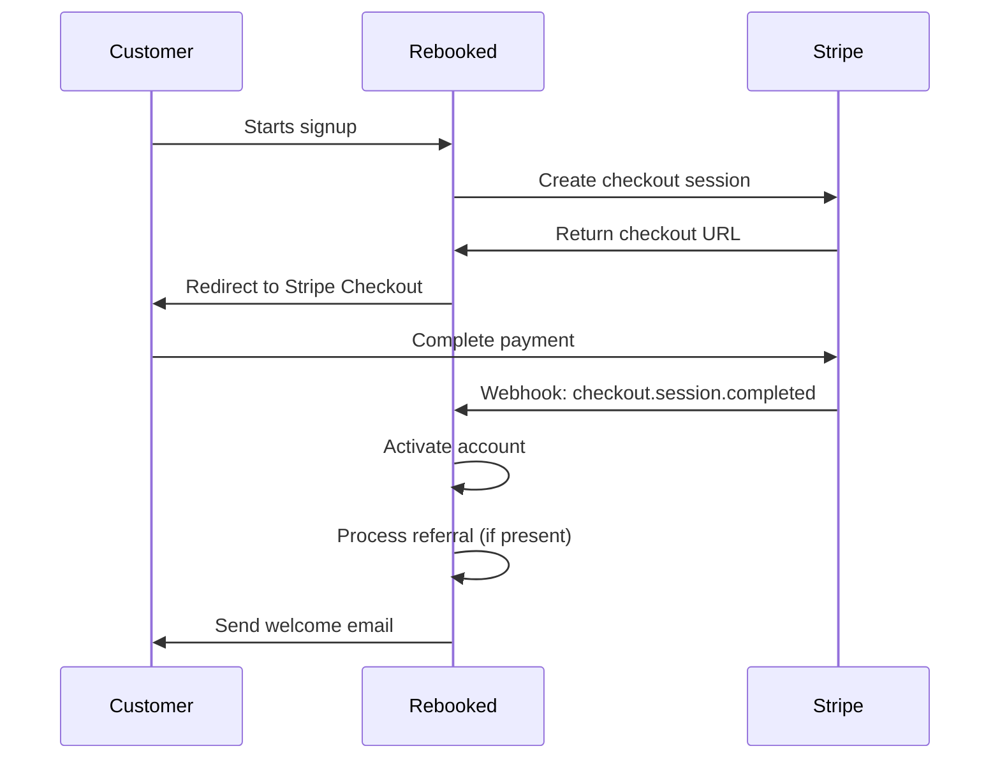
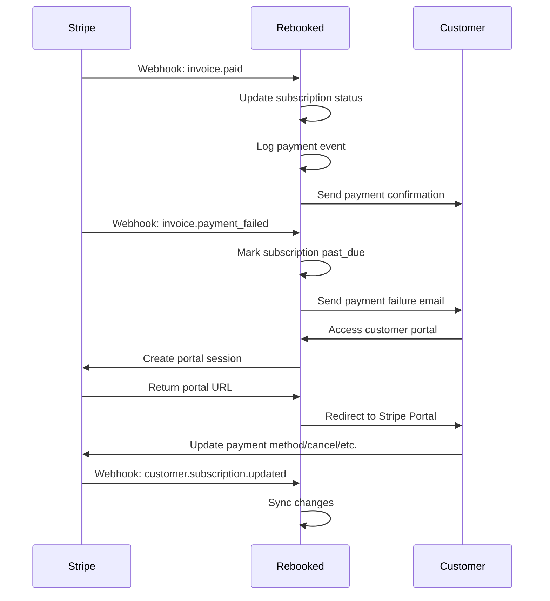
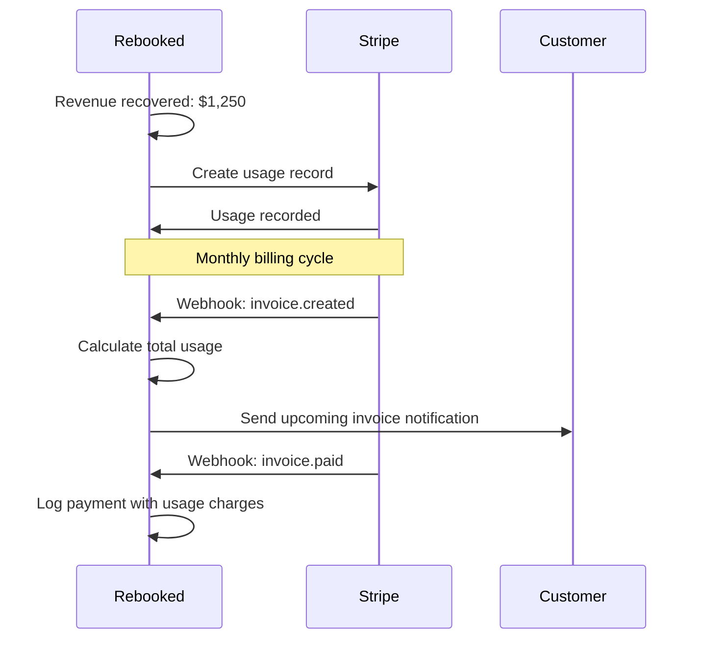
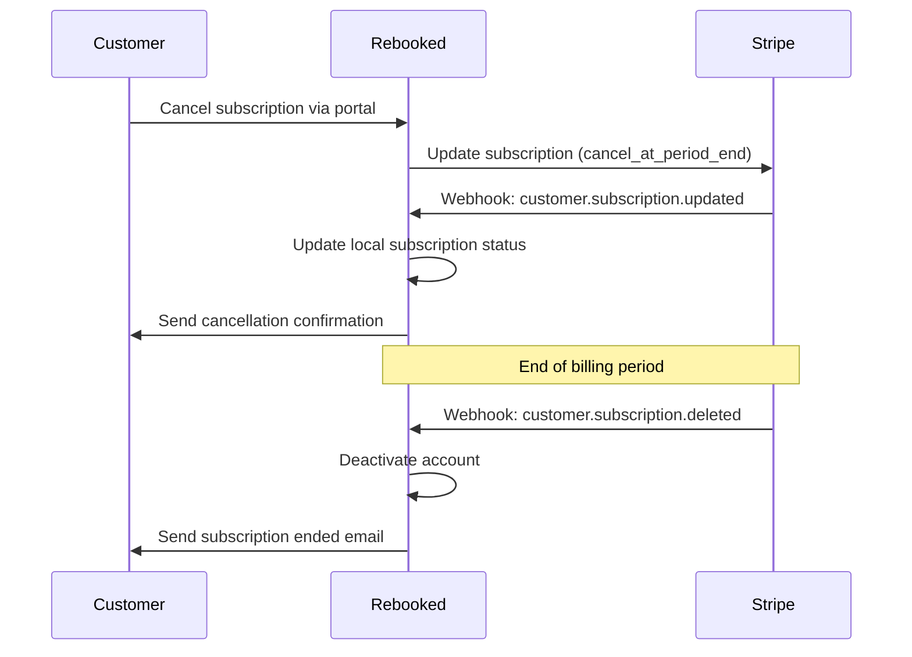

# 🎯 Stripe Lifecycle Management Implementation

Complete implementation of Stripe subscription lifecycle management with webhooks, customer portal, and comprehensive error handling.

## 📋 Overview

This implementation provides **complete subscription lifecycle management** for Rebooked's dual pricing model ($199 fixed + 15% metered billing) with:

- ✅ **Webhook Processing** for all subscription events
- ✅ **Customer Portal** for self-service management
- ✅ **Payment Tracking** and audit logging
- ✅ **Error Handling** and retry logic
- ✅ **Email Notifications** for key events
- ✅ **Usage Reporting** for metered billing
- ✅ **Referral Integration** with subscription completion

## 🏗️ Architecture

### Core Components

#### 1. Webhook Handler (`server/webhooks/stripe-webhook-handler.ts`)

**Purpose**: Process all Stripe webhook events and maintain subscription state

**Key Events Handled**:
- `checkout.session.completed` → Activate account, process referrals
- `invoice.paid` → Log payment, update subscription status
- `invoice.payment_failed` → Send failure email, mark past_due
- `customer.subscription.*` → Update subscription state
- `customer.*` → Sync customer data
- `payment_method.*` → Handle payment method changes

```typescript
export async function processStripeWebhook(event: WebhookEvent): Promise<void> {
  switch (event.type) {
    case 'checkout.session.completed':
      await handleCheckoutSessionCompleted(event.data.object);
      break;
    case 'invoice.paid':
      await handleInvoicePaid(event.data.object);
      break;
    // ... handle all other events
  }
}
```

#### 2. Customer Portal Service (`server/services/customer-portal.service.ts`)

**Purpose**: Provide self-service subscription management

**Features**:
- Create portal sessions for billing management
- Get subscription details and usage information
- Manage payment methods (add, remove, update default)
- Download invoices and billing history
- Track current usage for metered billing

```typescript
export async function createCustomerPortalSession(config: CustomerPortalConfig): Promise<PortalSessionData> {
  const session = await stripe.billingPortal.sessions.create({
    customer: config.customerId,
    return_url: config.returnUrl || `${process.env.FRONTEND_URL}/billing`,
  });
  
  return { url: session.url, sessionId: session.id };
}
```

#### 3. Database Schema (`server/migrations/002_add_webhook_and_payment_tables.sql`)

**Tables Created**:
- `webhook_events` - Audit log for all webhook processing
- `payment_events` - Payment transaction history
- `subscription_usage` - Usage tracking for metered billing
- `meter_events` - Detailed meter event history

**Views Created**:
- `customer_subscription_summary` - Customer analytics
- `monthly_revenue_summary` - Revenue reporting
- `subscription_churn_analysis` - Churn metrics
- `usage_metrics_summary` - Usage analytics

## 🔄 Lifecycle Management

### 1. Customer Onboarding



**Implementation**:
```typescript
async function handleCheckoutSessionCompleted(session: Stripe.Checkout.Session): Promise<void> {
  // Store subscription
  await storeSubscription(session);
  
  // Update user with Stripe customer ID
  await updateUserStripeId(session);
  
  // Process referral completion
  if (session.metadata?.referralCode) {
    await processReferralCompletion(session.metadata.referralCode);
  }
  
  // Activate user account
  await activateUserAccount(session.metadata?.userId);
  
  // Send welcome email
  await sendWelcomeEmail(session.metadata?.userId);
}
```

### 2. Ongoing Subscription Management



### 3. Usage Reporting (Metered Billing)



**Implementation**:
```typescript
export async function reportRevenueUsage(customerId: string, recoveredAmount: number): Promise<void> {
  const subscription = await stripe.subscriptions.list({
    customer: customerId,
    status: 'active',
    limit: 1,
  });

  const meteredItem = subscription.data[0].items.data.find(item => 
    item.price?.recurring?.usage_type === 'metered'
  );

  await stripe.subscriptionItems.createUsageRecord(meteredItem.id, {
    quantity: recoveredAmount,
    action: 'increment',
  });
}
```

### 4. Subscription Cancellation



## 🎯 Customer Portal Features

### 1. Subscription Management

**Available Actions**:
- View current subscription status and billing period
- Upgrade/downgrade plans
- Cancel subscription (immediate or end of period)
- Reactivate canceled subscription
- View upcoming invoices

### 2. Payment Method Management

**Features**:
- Add new payment methods
- Set default payment method
- Remove payment methods
- View payment method history

### 3. Billing History

**Features**:
- Download invoice PDFs
- View payment history
- Check payment status
- Access detailed line items

### 4. Usage Tracking

**For Metered Billing**:
- Current period usage
- Estimated charges
- Usage history
- Usage breakdown by service

## 📧 Email Notifications

### Event-Based Emails

| Event | Trigger | Content |
|-------|---------|---------|
| Welcome | `checkout.session.completed` | Account activated, subscription details |
| Payment Confirmation | `invoice.paid` | Payment received, amount charged |
| Payment Failure | `invoice.payment_failed` | Payment declined, retry information |
| Upcoming Invoice | `invoice.upcoming` | Invoice amount, due date |
| Trial Ending | `customer.subscription.trial_will_end` | Trial ending soon reminder |
| Cancellation | `customer.subscription.deleted` | Subscription canceled, access info |
| Referral Reward | Referral completion | $50 reward credited, payout info |

### Email Templates

```typescript
// Example: Payment failure email
async function sendPaymentFailureEmail(userId: number, amount: number): Promise<void> {
  const user = await getUserById(userId);
  
  await emailService.send({
    to: user.email,
    template: 'payment-failed',
    data: {
      customerName: user.name,
      amount: `$${amount.toFixed(2)}`,
      retryDate: new Date(Date.now() + 3 * 24 * 60 * 60 * 1000),
      billingUrl: `${process.env.FRONTEND_URL}/billing`,
    },
  });
}
```

## 🔧 Error Handling & Retry Logic

### 1. Webhook Processing Errors

```typescript
export async function processStripeWebhook(event: WebhookEvent): Promise<void> {
  try {
    // Process event
    await handleEvent(event);
    
    // Log successful processing
    await logWebhookEvent(event, 'processed');
  } catch (error) {
    // Log failure
    await logWebhookEvent(event, 'failed', error.message);
    
    // Retry logic for critical events
    if (isRetryableEvent(event.type)) {
      await scheduleRetry(event);
    }
    
    throw error;
  }
}
```

### 2. Payment Retry Logic

- **Automatic Retries**: Stripe automatically retries failed payments
- **Customer Notifications**: Email sent on each failure
- **Account Status**: Marked as `past_due` after 3 failures
- **Cancellation**: Auto-cancel after 7 days of non-payment

### 3. Monitoring & Alerting

```typescript
// Monitor webhook processing health
export async function getWebhookHealth(): Promise<WebhookHealth> {
  const last24Hours = await getRecentWebhookEvents(24);
  const failureRate = last24Hours.failed / last24Hours.total;
  
  return {
    totalEvents: last24Hours.total,
    successRate: 1 - failureRate,
    averageProcessingTime: last24Hours.averageTime,
    lastError: last24Hours.lastError,
  };
}
```

## 📊 Analytics & Reporting

### 1. Revenue Analytics

```sql
-- Monthly revenue summary
SELECT 
  DATE_FORMAT(created_at, '%Y-%m') as month,
  COUNT(DISTINCT customer_id) as paying_customers,
  SUM(CASE WHEN status = 'paid' THEN amount / 100 ELSE 0 END) as total_revenue,
  AVG(CASE WHEN status = 'paid' THEN amount / 100 ELSE NULL END) as average_payment
FROM payment_events
WHERE status = 'paid'
GROUP BY DATE_FORMAT(created_at, '%Y-%m');
```

### 2. Churn Analysis

```sql
-- Subscription churn metrics
SELECT 
  DATE_FORMAT(canceled_at, '%Y-%m') as month,
  COUNT(*) as canceled_subscriptions,
  AVG(DATEDIFF(canceled_at, created_at)) as avg_lifetime_days
FROM subscriptions
WHERE canceled_at IS NOT NULL
GROUP BY DATE_FORMAT(canceled_at, '%Y-%m');
```

### 3. Usage Metrics

```sql
-- Metered billing usage
SELECT 
  event_name,
  SUM(value) as total_usage,
  COUNT(DISTINCT customer_id) as unique_customers,
  AVG(value) as average_usage
FROM meter_events
WHERE created_at >= DATE_SUB(NOW(), INTERVAL 30 DAY)
GROUP BY event_name;
```

## 🚀 Deployment Checklist

### 1. Environment Setup

```bash
# Required environment variables
STRIPE_SECRET_KEY=sk_live_...
STRIPE_PUBLISHABLE_KEY=pk_live_...
STRIPE_WEBHOOK_SECRET=whsec_...
STRIPE_FIXED_PRICE_ID=price_FIXED_199
STRIPE_METERED_PRICE_ID=price_METERED_15
FRONTEND_URL=https://app.rebooked.com
```

### 2. Database Migration

```bash
# Run migrations in order
mysql -u root -p rebooked < server/migrations/001_create_referral_tables.sql
mysql -u root -p rebooked < server/migrations/002_add_webhook_and_payment_tables.sql
```

### 3. Stripe Configuration

1. **Create Products and Prices**:
   - Fixed price: $199/month
   - Metered price: 15% of recovered revenue

2. **Set Up Webhooks**:
   - Endpoint: `https://api.rebooked.com/api/stripe-webhooks/processWebhookEvent`
   - Events: All subscription and invoice events
   - Secret: Copy to environment variables

3. **Configure Customer Portal**:
   - Branding settings
   - Allowed actions (update, cancel, etc.)
   - Return URLs

### 4. Testing

```bash
# Test webhook connectivity
stripe listen --forward-to https://api.rebooked.com/api/stripe-webhooks/processWebhookEvent

# Test key events
stripe trigger checkout.session.completed
stripe trigger invoice.paid
stripe trigger customer.subscription.deleted
```

## 🔒 Security Considerations

### 1. Webhook Security

```typescript
// Verify webhook signature
export function verifyWebhookSignature(payload: string, signature: string, secret: string): boolean {
  const crypto = require('crypto');
  
  const elements = signature.split(',');
  const timestamp = elements[0].split('=')[1];
  const signatures = elements.slice(1).map(e => e.split('=')[1]);
  
  const signedPayload = `${timestamp}.${payload}`;
  
  return signatures.some(sig => {
    const expectedSig = crypto
      .createHmac('sha256', secret)
      .update(signedPayload, 'utf8')
      .digest('hex');
    
    return crypto.timingSafeEqual(
      Buffer.from(sig, 'hex'),
      Buffer.from(expectedSig, 'hex')
    );
  });
}
```

### 2. Data Protection

- **PII Encryption**: Sensitive customer data encrypted at rest
- **Access Controls**: Role-based access to billing data
- **Audit Logging**: All billing actions logged
- **Data Retention**: Configurable retention policies

### 3. Compliance

- **PCI DSS**: Stripe handles card data (PCI compliance)
- **GDPR**: Customer data management and deletion
- **SOX**: Financial transaction logging and audit trails

## 📈 Performance Optimization

### 1. Database Optimization

- **Indexes**: Optimized queries for subscription lookups
- **Partitioning**: Time-based partitioning for large tables
- **Caching**: Redis cache for frequently accessed data

### 2. API Performance

- **Rate Limiting**: Prevent abuse of billing endpoints
- **Async Processing**: Background jobs for email sending
- **Connection Pooling**: Efficient database connections

### 3. Monitoring

```typescript
// Performance metrics
export async function getBillingMetrics(): Promise<BillingMetrics> {
  return {
    checkoutConversionRate: await calculateCheckoutConversion(),
    paymentSuccessRate: await calculatePaymentSuccess(),
    webhookProcessingTime: await getAverageWebhookTime(),
    customerPortalUsage: await getPortalUsageStats(),
  };
}
```

## 🔄 Future Enhancements

### 1. Advanced Features

- **Multi-Currency Support**: International billing
- **Tax Management**: Stripe Tax integration
- **Discounts & Coupons**: Promotional codes
- **Trials**: Free trial periods
- **Usage Tiers**: Different pricing tiers for usage

### 2. Automation

- **Dunning Management**: Automated retry sequences
- **Churn Prediction**: ML-based churn risk scoring
- **Revenue Optimization**: Dynamic pricing suggestions
- **Customer Segmentation**: Behavioral billing analysis

### 3. Integrations

- **Accounting Systems**: QuickBooks, Xero integration
- **Analytics Platforms**: Segment, Mixpanel
- **CRM Systems**: Salesforce, HubSpot
- **Support Tools**: Zendesk, Intercom

---

**This implementation provides enterprise-grade subscription lifecycle management with comprehensive error handling, security, and scalability.** 🎯
