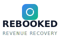

# 🚀 REBOOKED LOGO IMPLEMENTATION GUIDE

## 📁 **FILES CREATED**

### 🎨 **LOGO FILES**
```
client/src/assets/branding/
├── rebooked-logo-primary.svg      # Main horizontal logo
├── rebooked-logo-stacked.svg      # Vertical stacked logo
├── rebooked-icon.svg              # Icon only
├── rebooked-wordmark.svg          # Text only
├── logo-system.md                 # Complete brand guide
├── branding.css                   # CSS styles
└── implementation-guide.md        # This file
```

### 🧩 **COMPONENTS**
```
client/src/components/branding/
└── Logo.tsx                       # React logo component
```

---

## 🎯 **QUICK IMPLEMENTATION**

### 1️⃣ **IMPORT LOGO COMPONENT**
```tsx
import Logo from "@/components/branding/Logo";
```

### 2️⃣ **USE IN YOUR APP**
```tsx
// Primary logo (default)
<Logo />

// Different variants
<Logo variant="stacked" size="lg" />
<Logo variant="icon" size="sm" />
<Logo variant="wordmark" size="md" />

// With custom styling
<Logo variant="primary" size="lg" className="header-logo" />
```

### 3️⃣ **IMPORT BRANDING CSS**
```tsx
// In your main CSS file or App.tsx
import "@/assets/branding/branding.css";
```

---

## 🌐 **WEBSITE IMPLEMENTATION**

### 📱 **HEADER LOGO**
```tsx
// components/Header.tsx
import Logo from "@/components/branding/Logo";

export function Header() {
  return (
    <header className="rebooked-brand-header">
      <Logo variant="primary" size="md" />
      <nav>
        {/* Navigation */}
      </nav>
    </header>
  );
}
```

### 📱 **MOBILE HEADER**
```tsx
// components/MobileHeader.tsx
export function MobileHeader() {
  return (
    <header className="rebooked-brand-header">
      <Logo variant="icon" size="sm" />
      <span className="rebooked-font-heading">REBOOKED</span>
    </header>
  );
}
```

### 📱 **FOOTER LOGO**
```tsx
// components/Footer.tsx
export function Footer() {
  return (
    <footer className="rebooked-brand-footer">
      <Logo variant="stacked" size="md" />
      <p className="rebooked-font-tagline">Turn dropped calls into booked revenue</p>
    </footer>
  );
}
```

---

## 📧 **EMAIL IMPLEMENTATION**

### 📧 **EMAIL SIGNATURE**
```html
<!-- Email Signature Template -->
<table width="300" border="0" cellspacing="0" cellpadding="0">
  <tr>
    <td width="60" valign="top">
      
    </td>
    <td valign="top" style="font-family: 'Space Grotesk', sans-serif;">
      <div style="font-weight: 700; color: #0f172a; font-size: 16px;">
        REBOOKED
      </div>
      <div style="font-family: 'Inter', sans-serif; font-size: 10px; 
                  color: #64748b; letter-spacing: 0.1em; text-transform: uppercase;">
        REVENUE RECOVERY
      </div>
      <div style="font-family: 'Inter', sans-serif; font-size: 12px; 
                  color: #64748b; margin-top: 4px;">
        Turn dropped calls into booked revenue
      </div>
    </td>
  </tr>
</table>
```

---

## 🎨 **LANDING PAGE BANNER**
```tsx
// components/HeroBanner.tsx
export function HeroBanner() {
  return (
    <section className="rebooked-gradient-bg text-white py-20">
      <div className="container mx-auto text-center">
        <Logo variant="stacked" size="xl" className="mb-8 mx-auto" />
        <h1 className="rebooked-font-heading text-5xl mb-4">
          Turn Dropped Calls Into Booked Revenue
        </h1>
        <p className="rebooked-font-body text-xl mb-8 opacity-90">
          Intelligent follow-up automation that recovers lost customers
        </p>
        <button className="rebooked-button-secondary">
          Start Free Trial
        </button>
      </div>
    </section>
  );
}
```

---

## 📱 **MOBILE APP IMPLEMENTATION**

### 📱 **APP HEADER**
```tsx
// components/AppHeader.tsx
export function AppHeader() {
  return (
    <div className="flex items-center justify-between p-4 bg-white border-b">
      <Logo variant="icon" size="sm" />
      <h1 className="rebooked-font-heading text-lg">REBOOKED</h1>
      <button className="p-2">
        <MenuIcon />
      </button>
    </div>
  );
}
```

### 📱 **SPLASH SCREEN**
```tsx
// components/SplashScreen.tsx
export function SplashScreen() {
  return (
    <div className="flex flex-col items-center justify-center h-screen rebooked-gradient-bg">
      <Logo variant="stacked" size="xl" className="mb-4 rebooked-pulse" />
      <p className="text-white rebooked-font-tagline">REVENUE RECOVERY</p>
    </div>
  );
}
```

---

## 🎯 **BRANDING CONSISTENCY**

### 🎨 **COLOR USAGE**
```css
/* Primary brand colors */
.rebooked-primary { color: var(--rebooked-blue-500); }
.rebooked-secondary { color: var(--rebooked-emerald-500); }
.rebooked-accent { color: var(--rebooked-purple-500); }

/* Background colors */
.rebooked-bg-primary { background: var(--rebooked-blue-500); }
.rebooked-bg-secondary { background: var(--rebooked-emerald-500); }
.rebooked-gradient { background: linear-gradient(135deg, var(--rebooked-blue-500), var(--rebooked-emerald-500)); }
```

### 🎨 **TYPOGRAPHY**
```css
.rebooked-heading { 
  font-family: "Space Grotesk", sans-serif; 
  font-weight: 700; 
}

.rebooked-body { 
  font-family: "Inter", sans-serif; 
  font-weight: 400; 
}

.rebooked-tagline { 
  font-family: "Inter", sans-serif; 
  font-weight: 300; 
  text-transform: uppercase; 
  letter-spacing: 0.1em; 
}
```

---

## 📁 **ASSET DEPLOYMENT**

### 🌐 **PUBLIC ASSETS**
Copy these files to your public directory:
```bash
# Copy to public/assets/branding/
cp client/src/assets/branding/*.svg public/assets/branding/
cp client/src/assets/branding/branding.css public/assets/branding/
```

### 🌐 **CDN IMPLEMENTATION**
```html
<!-- For external websites -->

```

---

## 🎯 **USAGE EXAMPLES**

### 📧 **BUSINESS CARD**
```html
<div class="business-card">
  
  <div class="contact-info">
    <h3>Your Name</h3>
    <p>Revenue Recovery Specialist</p>
    <p>your.email@rebooked.com</p>
  </div>
</div>
```

### 📱 **SOCIAL MEDIA**
```html
<!-- Twitter Profile -->


<!-- LinkedIn Banner -->
<div class="linkedin-banner">
  
  <h2>Turn dropped calls into booked revenue</h2>
</div>
```

### 📧 **EMAIL TEMPLATES**
```html
<!-- Marketing Email Header -->
<table width="600" border="0" cellspacing="0" cellpadding="0">
  <tr>
    <td bgcolor="#0f172a" padding="20">
      
    </td>
  </tr>
</table>
```

---

## 🎯 **BEST PRACTICES**

### ✅ **DO'S**
- Use SVG files for scalability
- Maintain clear space around logos
- Use brand colors consistently
- Keep logos proportional
- Use appropriate file formats (SVG for web, PNG for print)

### ❌ **DON'TS**
- Stretch or distort logos
- Change brand colors arbitrarily
- Use low-resolution images
- Crowd logos with other elements
- Modify logo designs

---

## 🚀 **NEXT STEPS**

1. **Copy logo files to your public directory**
2. **Import the Logo component where needed**
3. **Apply branding CSS styles**
4. **Update existing logos throughout the app**
5. **Test across all devices and contexts**

---

**🎯 Your Rebooked branding is now ready for consistent implementation across all sectors!**
